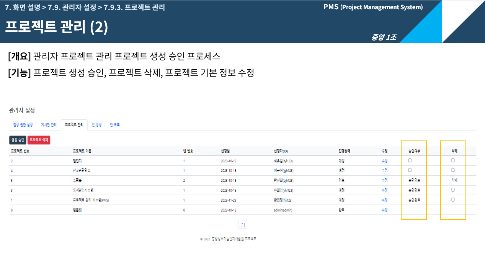

# connection

- 진행 기간 : 2023.10.23 ~ 2022.12.1 (6주간)  
- 프로젝트 명 : PMS (Project Management System)

## 팀원 소개
 - 팀장 : 황인정 

 - 팀원 : 강준우, 문경훈, 이광현, 이진희, 조미혜, 차예지  

## 기술 스택
-  
-  
-  
-   
-       

## 기획배경
 - 프로젝트 경험이 없는 신입 개발자가 처음 시작하면 마주하는 막막함을 해결하기 위해 만들었습니다.
 - 산출물의 이력관리 및 팀원 개개인의 진행사항을 한눈에 파악 할 수있도록 만들었습니다.  

## 프로젝트 소개
 - 프로젝트 전체 진행상황을 체계화/시각화하여 프로젝트 스케쥴 관리의 편리성을 높였습니다.
 - 효율적인 프로젝트 산출물 관리를 통해 개발 표준화 제공 및 프로젝트 품질을 향상 시켰습니다.
 - 작업 진행사항 및 기록 공유로 원활한 의사소통이 가능 합니다.

 
### 프로젝트 프로세스
 - 팀장 : 프로젝트 생성 신청, 프로젝트 단계별 프로파일 생성
 - 팀원 : 프로젝트 상세화면 (작업문서, 타임라인), 프로젝트용 캘린더, 게시판
 - 일반 회원 : 전체 게시판, 채팅, To-do-List, 알림, 내글 모음
 - 관리자 : 팀장권한 부여, 프로젝트 생성승인, 프로젝트 생성, 반생성등 프로젝트의 전반적인 관리를 함

### 주요 기능
 - 프로젝트 : 프로젝트 생성, 프로젝트 단계별 프로파일, 차트, 타임라인, 회의록
 - 공지사항 : 전체, 이벤트, 자유, Q&A
 - 알림, 채팅, 통합검색

  
  
 
## 나의 구현 기능

 ### 프로젝트 생성

  

   
  
 ### 프로젝트 단계 프로파일

  
  
  
  
  
  
 ### 프로젝트 승인

  
  
  
 ### 통합검색

  
  
